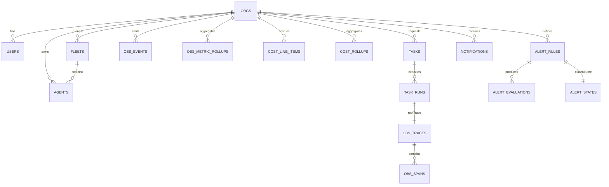

# ALIAS AEOS Observability Architecture

> End-to-end observability for ALIAS Org (internal) and Clients (multi-tenant)

## Executive Summary

Build observability as a **tiered telemetry system**:
1. **High-cardinality events + traces** - short-lived (7-30 days)
2. **Low-cardinality metric rollups** - long-lived for dashboards
3. **Alert evaluations + notifications** - derived from rollups

Multi-tenancy: **every telemetry row belongs to exactly one `orgId`**, with ALIAS staff having cross-org query privileges.

---

## Core Subsystems

| Acronym | Full Name | Observability Focus |
|---------|-----------|---------------------|
| **MOSAIC** | Meta-Orchestration System for AI Collaboration | Decision quality, latency, routing, throughput |
| **DAMN** | Distributed Agent Management Network | Availability, capacity, fleet health, heartbeats |
| **UCE** | Unified Context Engine | Context ops, cache hits, size, retrieval latency |

---

## Current State Analysis

### Existing Schema (what we have)

```
observabilityEvents     - Single event stream (no orgId, no multi-tenancy)
uceNeuralActivations    - UCE neural network (35 neurons)
squadronStatus          - 3 squadrons x 9 agents = 27 agents
```

### Existing Components

```
src/components/observability/
├── EventTimeline.tsx      - Real-time event feed
├── SquadronPanel.tsx      - Agent fleet status
├── NeuralNetworkViz.tsx   - UCE heatmap visualization
├── CostTracker.tsx        - LLM cost breakdown
├── FilterPanel.tsx        - Query filters
└── PlaygroundTile.tsx     - Dashboard tiles
```

### Gaps to Address

| Gap | Current | Required |
|-----|---------|----------|
| Multi-tenancy | None | `orgId` on every row |
| ALIAS vs Client | Single view | Separate dashboards |
| Metric rollups | None | Minute/hour/day aggregations |
| Traces/spans | None | Causal task execution timeline |
| Cost rollups | Per-event only | Daily/org/model aggregations |
| Alerting | None | Rules, evaluations, notifications |
| Retention | Infinite | Time-based pruning + export |

---

## Architecture Design

### Data Flow

```
┌─────────────────────────────────────────────────────────────────────┐
│                        ALIAS AEOS Platform                          │
├─────────────────────────────────────────────────────────────────────┤
│                                                                     │
│  ┌─────────────┐   ┌─────────────┐   ┌─────────────┐               │
│  │   MOSAIC    │   │    DAMN     │   │     UCE     │               │
│  │ Orchestrator│   │   Agents    │   │   Context   │               │
│  └──────┬──────┘   └──────┬──────┘   └──────┬──────┘               │
│         │                 │                 │                       │
│         └────────────┬────┴────────────────┘                       │
│                      ▼                                              │
│  ┌───────────────────────────────────────────────────────────────┐ │
│  │              Agent SDK (batch buffer + HMAC signing)          │ │
│  └───────────────────────────────┬───────────────────────────────┘ │
│                                  ▼                                  │
├─────────────────────────────────────────────────────────────────────┤
│                         Convex Backend                              │
├─────────────────────────────────────────────────────────────────────┤
│                                                                     │
│  ┌─────────────────┐    ┌─────────────────┐    ┌─────────────────┐ │
│  │ HTTP Action:    │    │   Mutations:    │    │   Scheduled:    │ │
│  │ ingestTelemetry │───▶│ writeEvents/    │───▶│ rollups +       │ │
│  │ (batched)       │    │ spans/costs     │    │ retention +     │ │
│  └─────────────────┘    └────────┬────────┘    │ alertEval       │ │
│                                  │             └────────┬────────┘ │
│                                  ▼                      │          │
│  ┌───────────────────────────────────────────────────────────────┐ │
│  │                      Convex Tables                            │ │
│  │  ┌──────────────┐ ┌──────────────┐ ┌──────────────┐          │ │
│  │  │  obsEvents   │ │  obsSpans    │ │ obsMetric    │          │ │
│  │  │  (14 days)   │ │  (7 days)    │ │ Rollups      │          │ │
│  │  └──────────────┘ └──────────────┘ └──────────────┘          │ │
│  │  ┌──────────────┐ ┌──────────────┐ ┌──────────────┐          │ │
│  │  │ costRollups  │ │ alertStates  │ │ notifications│          │ │
│  │  └──────────────┘ └──────────────┘ └──────────────┘          │ │
│  └───────────────────────────────────────────────────────────────┘ │
│                                  │                                  │
└──────────────────────────────────┼──────────────────────────────────┘
                                   ▼
┌─────────────────────────────────────────────────────────────────────┐
│                         Dashboards                                  │
├─────────────────────────┬───────────────────────────────────────────┤
│   ALIAS Org (Internal)  │           Client Org (Scoped)             │
├─────────────────────────┼───────────────────────────────────────────┤
│ • Global Overview       │ • Org Overview                            │
│ • Org Explorer          │ • Agents & Fleets                         │
│ • Fleet/Agent Explorer  │ • Task Runs                               │
│ • Anomalies & Incidents │ • Costs                                   │
│ • Platform Health       │ • Alerts & Settings                       │
└─────────────────────────┴───────────────────────────────────────────┘
```

---

## Entity-Relationship Diagram



---

## Multi-Tenancy Model

### WorkOS Integration

```typescript
// Map WorkOS organizationId to Convex orgId
orgs: defineTable({
  workosOrgId: v.string(),      // From WorkOS
  name: v.string(),
  plan: v.optional(v.string()), // "free" | "pro" | "enterprise"
  createdAt: v.number(),
}).index("by_workosOrgId", ["workosOrgId"])

// Users with optional ALIAS staff role
users: defineTable({
  workosUserId: v.string(),
  orgId: v.id("orgs"),
  email: v.string(),
  systemRole: v.optional(v.union(
    v.literal("alias_admin"),    // Cross-org read access
    v.literal("alias_support")   // Limited cross-org access
  )),
})
```

### Access Control

| Role | Scope | Capabilities |
|------|-------|--------------|
| `alias_admin` | All orgs | Full read, system config |
| `alias_support` | All orgs | Read-only, support tools |
| Org Admin | Own org | Full CRUD within org |
| Org Member | Own org | Read dashboards, limited config |

---

## Recommended Schema

### Core Tables

```typescript
// convex/schema.ts additions

// Organizations (multi-tenancy root)
orgs: defineTable({
  workosOrgId: v.string(),
  name: v.string(),
  plan: v.optional(v.string()),
  createdAt: v.number(),
}).index("by_workosOrgId", ["workosOrgId"]),

// Agent fleets (grouping)
fleets: defineTable({
  orgId: v.id("orgs"),
  name: v.string(),
  createdAt: v.number(),
}).index("by_orgId", ["orgId"]),

// Agents with subsystem tagging
agents: defineTable({
  orgId: v.id("orgs"),
  fleetId: v.optional(v.id("fleets")),
  name: v.string(),
  subsystem: v.union(
    v.literal("MOSAIC"),
    v.literal("DAMN"),
    v.literal("UCE"),
    v.literal("SYSTEM")
  ),
  status: v.union(v.literal("online"), v.literal("offline"), v.literal("degraded")),
  lastHeartbeatAt: v.number(),
  version: v.optional(v.string()),
  createdAt: v.number(),
})
  .index("by_orgId", ["orgId"])
  .index("by_org_fleet", ["orgId", "fleetId"])
  .index("by_org_status", ["orgId", "status"]),

// Tasks and runs
tasks: defineTable({
  orgId: v.id("orgs"),
  title: v.optional(v.string()),
  createdAt: v.number(),
}).index("by_org_createdAt", ["orgId", "createdAt"]),

taskRuns: defineTable({
  orgId: v.id("orgs"),
  taskId: v.id("tasks"),
  agentId: v.optional(v.id("agents")),
  status: v.union(
    v.literal("queued"),
    v.literal("running"),
    v.literal("succeeded"),
    v.literal("failed"),
    v.literal("canceled")
  ),
  durationMs: v.optional(v.number()),
  traceId: v.optional(v.id("obsTraces")),
  costUsd: v.optional(v.number()),
  createdAt: v.number(),
})
  .index("by_org_createdAt", ["orgId", "createdAt"])
  .index("by_org_status_createdAt", ["orgId", "status", "createdAt"]),
```

### Observability Tables

```typescript
// Events (high-volume, short retention: 14 days)
obsEvents: defineTable({
  orgId: v.id("orgs"),
  ts: v.number(),
  severity: v.union(v.literal("debug"), v.literal("info"), v.literal("warn"), v.literal("error")),
  subsystem: v.union(v.literal("MOSAIC"), v.literal("DAMN"), v.literal("UCE"), v.literal("SYSTEM")),
  eventType: v.string(),
  agentId: v.optional(v.id("agents")),
  fleetId: v.optional(v.id("fleets")),
  taskRunId: v.optional(v.id("taskRuns")),
  message: v.optional(v.string()),
  payload: v.optional(v.any()),
})
  .index("by_org_ts", ["orgId", "ts"])
  .index("by_org_severity_ts", ["orgId", "severity", "ts"])
  .index("by_org_agent_ts", ["orgId", "agentId", "ts"]),

// Traces (short retention: 7 days)
obsTraces: defineTable({
  orgId: v.id("orgs"),
  startedAt: v.number(),
  endedAt: v.optional(v.number()),
  durationMs: v.optional(v.number()),
  status: v.union(v.literal("ok"), v.literal("error")),
  taskRunId: v.optional(v.id("taskRuns")),
  sampled: v.boolean(),
}).index("by_org_startedAt", ["orgId", "startedAt"]),

// Spans (short retention: 7 days)
obsSpans: defineTable({
  orgId: v.id("orgs"),
  traceId: v.id("obsTraces"),
  parentSpanId: v.optional(v.id("obsSpans")),
  name: v.string(),
  subsystem: v.union(v.literal("MOSAIC"), v.literal("DAMN"), v.literal("UCE"), v.literal("SYSTEM")),
  startedAt: v.number(),
  endedAt: v.optional(v.number()),
  durationMs: v.optional(v.number()),
  status: v.union(v.literal("ok"), v.literal("error")),
  attributes: v.optional(v.any()),
})
  .index("by_trace_startedAt", ["traceId", "startedAt"])
  .index("by_org_startedAt", ["orgId", "startedAt"]),

// Metric rollups (long retention: 90+ days)
obsMetricRollups: defineTable({
  orgId: v.id("orgs"),
  metric: v.string(),           // "latency_ms", "errors", "tokens_in"
  bucketMs: v.number(),         // 60000 (min), 3600000 (hour), 86400000 (day)
  bucketStart: v.number(),      // Epoch ms floored to bucket
  dimensionHash: v.string(),    // Stable hash of dimensions
  dimensions: v.optional(v.any()),
  count: v.number(),
  sum: v.number(),
  min: v.number(),
  max: v.number(),
  updatedAt: v.number(),
})
  .index("by_org_metric_bucket", ["orgId", "metric", "bucketMs", "bucketStart"])
  .index("by_org_bucket", ["orgId", "bucketMs", "bucketStart"]),
```

### Cost Tables

```typescript
// Cost line items (per LLM call)
costLineItems: defineTable({
  orgId: v.id("orgs"),
  ts: v.number(),
  taskRunId: v.optional(v.id("taskRuns")),
  agentId: v.optional(v.id("agents")),
  subsystem: v.optional(v.union(v.literal("MOSAIC"), v.literal("DAMN"), v.literal("UCE"), v.literal("SYSTEM"))),
  provider: v.optional(v.string()),  // "openai", "anthropic", "google"
  model: v.optional(v.string()),
  tokensIn: v.optional(v.number()),
  tokensOut: v.optional(v.number()),
  costUsd: v.number(),
})
  .index("by_org_ts", ["orgId", "ts"]),

// Cost rollups (daily aggregates)
costRollups: defineTable({
  orgId: v.id("orgs"),
  dayStart: v.number(),
  dimensionHash: v.string(),
  dimensions: v.optional(v.any()),
  costUsd: v.number(),
  tokensIn: v.optional(v.number()),
  tokensOut: v.optional(v.number()),
  updatedAt: v.number(),
}).index("by_org_day", ["orgId", "dayStart"]),
```

### Alerting Tables

```typescript
// Alert rules
alertRules: defineTable({
  orgId: v.id("orgs"),
  name: v.string(),
  enabled: v.boolean(),
  severity: v.union(v.literal("info"), v.literal("warning"), v.literal("critical")),
  type: v.string(),  // "threshold" | "budget" | "heartbeat" | "anomaly"
  params: v.any(),   // { metric, windowMs, threshold, comparator }
  createdAt: v.number(),
}).index("by_org_enabled", ["orgId", "enabled"]),

// Alert states (current firing state)
alertStates: defineTable({
  orgId: v.id("orgs"),
  ruleId: v.id("alertRules"),
  isFiring: v.boolean(),
  lastEvaluatedAt: v.number(),
  lastChangedAt: v.number(),
  lastValue: v.optional(v.number()),
}).index("by_org_rule", ["orgId", "ruleId"]),

// Notifications (in-app inbox)
notifications: defineTable({
  orgId: v.id("orgs"),
  createdAt: v.number(),
  type: v.string(),  // "alert.firing", "alert.resolved", "system.notice"
  title: v.string(),
  body: v.optional(v.string()),
  readAt: v.optional(v.number()),
}).index("by_org_createdAt", ["orgId", "createdAt"]),

// Webhook endpoints
notificationEndpoints: defineTable({
  orgId: v.id("orgs"),
  kind: v.literal("webhook"),
  url: v.string(),
  secret: v.optional(v.string()),
  enabled: v.boolean(),
  createdAt: v.number(),
}).index("by_org_enabled", ["orgId", "enabled"]),
```

---

## Dashboard Views

### ALIAS Org (Internal) - Global Operations Console

| View | Purpose | Data Source |
|------|---------|-------------|
| **Global Overview** | Total orgs, agents, error rate, cost | Cross-org aggregates |
| **Org Explorer** | Table of all orgs with health scores | `orgs` + rollups |
| **Fleet Explorer** | Top failing agents across orgs | `agents` + events |
| **Anomalies** | Alert feed + anomaly detection | `alertStates` |
| **Platform Health** | Convex function latency, ingest errors | System metrics |

### Client Org - Scoped Observability

| View | Purpose | Data Source |
|------|---------|-------------|
| **Org Overview** | Success rate, latency, cost today | Rollups |
| **Agents & Fleets** | Status, heartbeats, utilization | `agents` |
| **Task Runs** | Searchable list, drill-down | `taskRuns` + spans |
| **Costs** | By agent/model/subsystem, budget alerts | `costRollups` |
| **Alerts & Settings** | Rules, endpoints, retention | Config tables |

---

## Subsystem Visualizations

### MOSAIC (Orchestration)

| Visualization | Metrics |
|---------------|---------|
| Orchestration Timeline | EventTimeline filtered to MOSAIC |
| Plan Graph / DAG | NeuralNetworkViz: nodes=agents, edges=handoffs |
| Routing Decisions | Top routes by success rate |
| Critical Path | Trace span waterfall |

### DAMN (Distribution/Management)

| Visualization | Metrics |
|---------------|---------|
| Fleet Health Grid | SquadronPanel with status colors |
| Agent Heartbeat | Time series uptime chart |
| Version Skew | Deployment version distribution |
| Queue Depth | Backlog metric rollups |

### UCE (Context Engine)

| Visualization | Metrics |
|---------------|---------|
| Context Ops | Read/write ops per minute |
| Context Size | p50/p95 size distribution |
| Cache Hit Rate | Hit vs miss ratio |
| Top Contexts by Churn | Frequently rewritten contexts |

---

## Retention Strategy

| Data Type | Free | Pro | Enterprise |
|-----------|------|-----|------------|
| `obsEvents` | 7 days | 14 days | 30 days |
| `obsSpans` | 3 days | 7 days | 14 days |
| Minute rollups | 7 days | 14 days | 30 days |
| Hour rollups | 30 days | 90 days | 180 days |
| Day rollups | 90 days | 1 year | 2 years |
| `costLineItems` | 90 days | 1 year | 2 years |

---

## Implementation Phases

### Phase 1: MVP Operational Telemetry (1-2 days)
**Goal:** "We can see what's happening now for one org"

- [ ] Add `orgId` to existing observability tables
- [ ] Create `orgs` and `fleets` tables
- [ ] Migrate `observabilityEvents` → `obsEvents`
- [ ] Add `costLineItems` table
- [ ] Update existing queries to scope by `orgId`
- [ ] Basic client dashboard

**Deliverable:** Client can see agents, events, and costs

### Phase 2: Rollups + Performance Dashboards (2-3 days)
**Goal:** "Dashboards are fast and historical"

- [ ] Create `obsMetricRollups` table
- [ ] Scheduled function for minute → hour → day rollups
- [ ] Add latency/throughput/success charts
- [ ] ALIAS Org global overview (cross-org KPIs)
- [ ] Retention pruning job

**Deliverable:** ALIAS team can answer "Which org is unhealthy?"

### Phase 3: Tracing (2-3 days)
**Goal:** "We can debug slowness and failures causally"

- [ ] Add `obsTraces` and `obsSpans` tables
- [ ] Trace sampling (100% errors, N% success)
- [ ] Trace explorer in task run details
- [ ] Span waterfall visualization

**Deliverable:** Client can answer "Where did the time go?"

### Phase 4: Alerting & Notifications (2-3 days)
**Goal:** "We detect issues before clients do"

- [ ] Add `alertRules`, `alertStates`, `notifications` tables
- [ ] Scheduled alert evaluation (every 1-5 min)
- [ ] In-app notification bell + inbox
- [ ] Email notifications (Resend)
- [ ] Webhook integrations

**Deliverable:** Proactive ops with threshold + budget alerts

### Phase 5: Custom Dashboards (Optional, 3-5 days)
**Goal:** "Clients build their own dashboards"

- [ ] Add `dashboards` and `dashboardWidgets` tables
- [ ] Widget builder UI
- [ ] Dashboard sharing + permissions

**Deliverable:** Self-service dashboard creation

---

## Next Steps

1. **Review this architecture** - Confirm scope and priorities
2. **Phase 1 implementation** - Start with schema migration
3. **Iterate on dashboards** - Build incrementally, get feedback

---

*Generated by Oracle Architecture Advisor*
*Last Updated: December 20, 2025*
